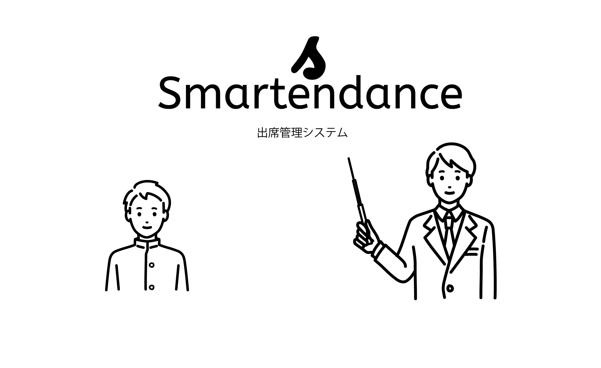

# 出席管理システム『Smartendance』

- U-22 プログラミング・コンテスト2021応募作品。
- IoTの技術を活用して、先生方の業務を減らし、学生の出席管理をよりスマートにしようという考えから制作しました。
- このリポジトリはAPIのソースコードです。（iOSアプリのリポジトリは[こちら](https://github.com/ryota-k0827/SmartendanceApp)）

## 使用言語
- PHP
- SQL
- Swift（別リポジトリにup）

## 動作環境
- iOS14を搭載したiPhone7, iPhone8, iPhene SE(2020), iPhone 12 mini（実機2台、もしくはエミュレーター1台と実機1台必要）
- macOS 11以上を搭載したMac（アプリをビルドする際に使用）
- [Xcode 12](https://apps.apple.com/jp/app/xcode/id497799835?mt=12)

## 操作手順
1. BLEビーコンが必要です。
2. [Xcode 12](https://apps.apple.com/jp/app/xcode/id497799835?mt=12)をインストール。
3. Xcodeで[SmartendanceApp](https://github.com/ryota-k0827/SmartendanceApp)をiPhoneへビルド。
4. エミュレータもしくは実機で教官アカウントを使用してログイン。（[ログイン情報.pdf](https://github.com/ryota-k0827/Smartendance/blob/main/%E3%83%AD%E3%82%B0%E3%82%A4%E3%83%B3%E6%83%85%E5%A0%B1.pdf)を参照）
5. もう一台の実機で生徒アカウントを使用してログイン。（[ログイン情報.pdf](https://github.com/ryota-k0827/Smartendance/blob/main/%E3%83%AD%E3%82%B0%E3%82%A4%E3%83%B3%E6%83%85%E5%A0%B1.pdf)を参照。エミュレータ不可）
6. BLEビーコンを用意する。（[時間割表.pdf](https://github.com/ryota-k0827/Smartendance/blob/main/%E6%99%82%E9%96%93%E5%89%B2%E8%A1%A8.pdf)に使用可能なUUIDを記載。）
7. 生徒アカウントでログインした端末で出席確認を行う。（[時間割表.pdf](https://github.com/ryota-k0827/Smartendance/blob/main/%E6%99%82%E9%96%93%E5%89%B2%E8%A1%A8.pdf)から時間割を参照。）
8. 教官アカウントでログインした端末で欠席者一覧を確認できます。

## デモ動画
- [YouTube](https://youtu.be/yMKV9JE0Vlg)
